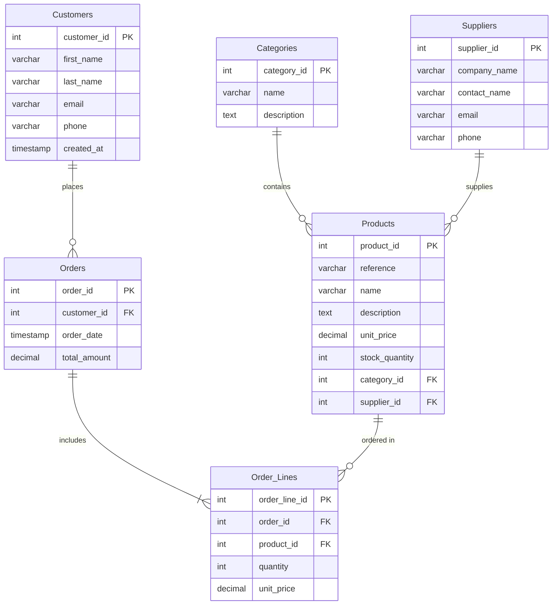

```mermaid
erDiagram
    Categories {
        int category_id PK
        varchar name
        text description
    }

    Suppliers {
        int supplier_id PK
        varchar company_name
        varchar contact_name
        varchar email
        varchar phone
    }

    Products {
        int product_id PK
        varchar reference
        varchar name
        text description
        decimal unit_price
        int stock_quantity
        int category_id FK
        int supplier_id FK
    }

    Customers {
        int customer_id PK
        varchar first_name
        varchar last_name
        varchar email
        varchar phone
        timestamp created_at
    }

    Orders {
        int order_id PK
        int customer_id FK
        timestamp order_date
        decimal total_amount
    }

    Order_Lines {
        int order_line_id PK
        int order_id FK
        int product_id FK
        int quantity
        decimal unit_price
    }

    Categories ||--o{ Products : contains
    Suppliers ||--o{ Products : supplies
    Customers ||--o{ Orders : places
    Orders ||--|{ Order_Lines : includes
    Products ||--o{ Order_Lines : "ordered in"
```
